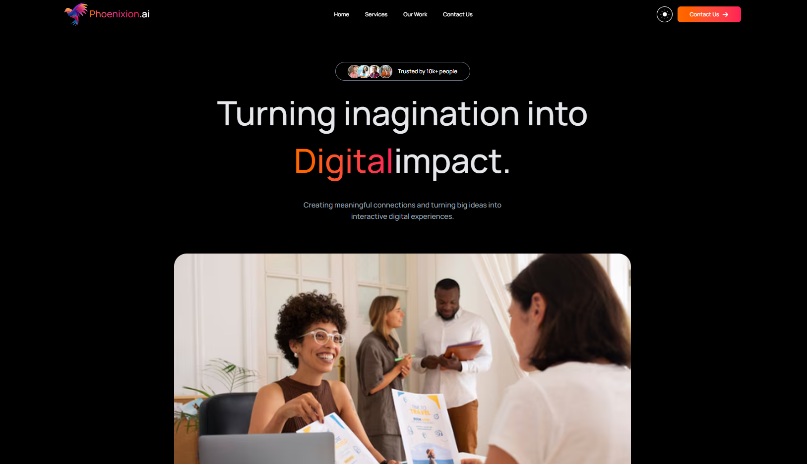

# 🚀 Phoenixion.ai – Modern Digital Experience Agency

A modern, high-performance digital agency website built with **React 19**, **Tailwind CSS 4**, and **Framer Motion**. Phoenixion.ai delivers a premium user experience through elegant design, smooth animations, responsive layouts, and seamless dark/light theme switching.

## 🌐 Live Demo

**Website:** https://phoenixion.netlify.app/

---

<br>
<br>


---
## 📸 Preview

Phoenixion.ai is designed to showcase modern digital services through a visually engaging and conversion-focused interface.

### Key Highlights

- Modern agency-style landing page
- Fully responsive design
- Dark & Light theme support
- Smooth animations with Framer Motion
- Interactive user experience
- Mobile-first approach
- Performance optimized

---

## ✨ Features

### 🎨 Modern UI/UX

Clean layouts, professional typography, and carefully crafted spacing for a premium visual experience.

### 🌙 Dark & Light Mode

Users can seamlessly switch between dark and light themes.

### ⚡ Smooth Animations

Built with Framer Motion to create engaging transitions and scroll-based animations.

### 📱 Fully Responsive

Optimized for:

- Mobile Devices
- Tablets
- Laptops
- Desktop Screens

### 🔥 Interactive Components

- Animated Hero Section
- Theme Toggle
- CTA Buttons
- Trust Indicators
- Company Showcase

### 🚀 Performance Focused

- Fast loading
- Optimized assets
- Clean component structure
- Modern React architecture

---

## 🛠️ Tech Stack

### Frontend

- React 19
- JavaScript (ES6+)
- Tailwind CSS 4

### Animation

- Framer Motion

### Icons

- Font Awesome

### Notifications

- React Hot Toast

### Build Tool

- Vite

### Deployment

- Netlify

---

## 📦 Dependencies

```json
{
  "react": "^19.2.0",
  "tailwindcss": "^4.1.18",
  "motion": "^12.34.0",
  "react-hot-toast": "^2.6.0",
  "@fortawesome/react-fontawesome": "^3.2.0"
}
```

---

## 🚀 Getting Started

### Clone Repository

```bash
git clone https://github.com/engr-sudiptto/Phoenixion.git
```

### Navigate to Project

```bash
cd phoenixion
```

### Install Dependencies

```bash
npm install
```

### Run Development Server

```bash
npm run dev
```

### Build Production Version

```bash
npm run build
```

---

## 📁 Project Structure

```bash
Phoenixion/
│
├── src
│   ├── assets/
│   ├── components/
├── App.jsx
├── index.css
└── main.jsx
```

---

## 🎯 Project Goals

This project was created to demonstrate:

- Modern React Development
- Component-Based Architecture
- Responsive Web Design
- Animation Integration
- Theme Management
- Clean UI/UX Practices

---

## 💡 Future Improvements

- Case Studies Section
- Client Testimonials
- Contact Form Backend
- Blog System
- SEO Optimization


---


## 👨‍💻 Author

### **--Sudipto Das--**

**Lead Front-End Engineer | React, Next.js, JS & TS | Bridging UI/UX Architecture with Scalable Styling (Sass & Tailwind CSS)**

#### Skills

- HTML5
- CSS3
- JavaScript
- TypeScript
- React
- Redux
- Next.js
- Tailwind CSS
- Bootstrap
- Node.js
- Express.js
- MongoDB
- Firebase
- SQL

---

## ⭐ Support

If you like this project, consider giving it a ⭐ on GitHub. It helps support future development and motivates me to build more open-source projects.

---

## 📄 License

This project is licensed under the MIT License.